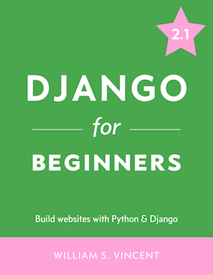

#Why Django? 

> Django is a Web framework written in Python. A Web framework is a software that supports the development of dynamic Web sites, applications, and services. It provides a set of tools and functionalities that solves many common problems associated with Web development, such as security features, database access, sessions, template processing, URL routing, internationalization, localization, and much more.

Using a Web framework, such as Django, enables us to develop secure and reliable Web applications very quickly in a standardized way, without having to reinvent the wheel.

The official source code for _Django for Beginners_.

Preview the book at [https://djangoforbeginners.com/](https://djangoforbeginners.com/).

Available as an [ebook (with free updates)](https://gum.co/aFiMm), [Paperback](https://www.amazon.com/dp/1983172669/?tag=wsvincent-20), or [Kindle](https://www.amazon.com/dp/B079ZZLRRL/?tag=wsvincent-20).
